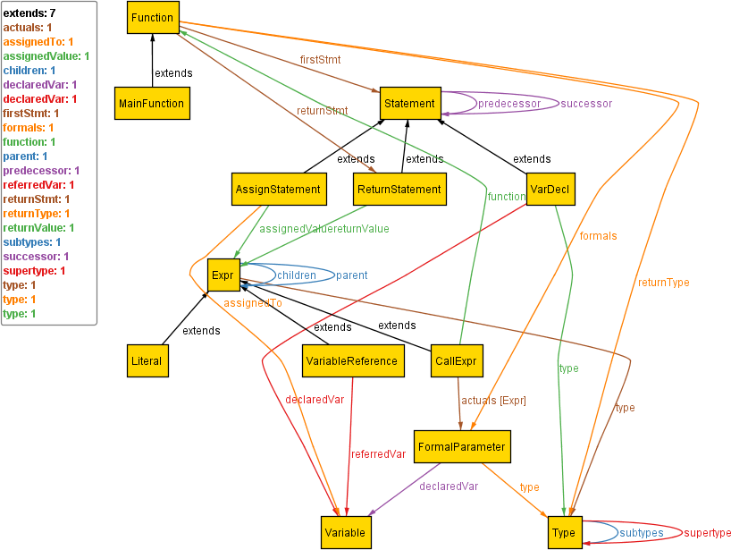

# ETH SAE Project 1 - Sherlock

## UML class diagram

!include ../src/task-a/non-uml-encodable-elements.md

## Alloy model from task B

!include ../src/task-b/non-alloy-encodable-elements.md

## Alloy model from task D

!include ../src/task-c/non-feasible-instances.md

## Image exports from task C

### Instance 2
!loop-images instances/task-c/inst2/*.png

### Instance 3
!loop-images instances/task-c/inst3/*.png

### Instance 4
!loop-images instances/task-c/inst4/*.png

!include ../src/task-e/non-feasible-instances.md
